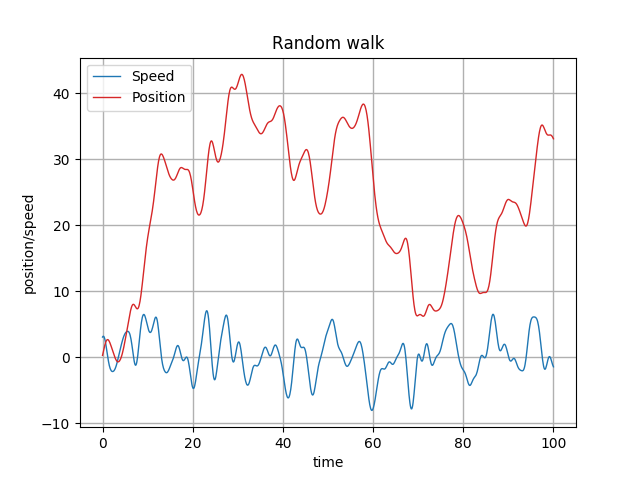

# KyPlot

Kotlin plotting library backed by Python's `matplotlib`. A `python3` interpreter
with `matplotlib` installed has to be available in the system.

KyPlot provides a declarative DSL for plotting as shown in the example below:

```kotlin
fun main() {

    val amount = 1000
    val max = 100.0
    val delta = max / amount

    val time = linearSpace(
            start = 0.0,
            stop = max,
            amount = amount
    )

    val windowSize = 100

    // Gaussian filter
    val filter = doubleArray1D(windowSize) { i ->
        exp(-(i - windowSize / 2.0).squared() / 10.0.squared())
    }

    val speed = Random.nextGaussianArray1D(time.size).filter1D(filter)
    val position = speed.cumulativeSum() * delta

    showPlot {
        title = "Random walk"

        line(x = time, y = speed) {
            label = "Speed"
            color = Color.BLUE
        }

        line(x = time, y = position) {
            label = "Position"
            color = Color.RED
        }

        xAxis {
            label = "time"
        }

        yAxis {
            label = "position/speed"
        }

        legend.visible = true
        legend.position = Legend.Position.UPPER_LEFT

    }

}
```


